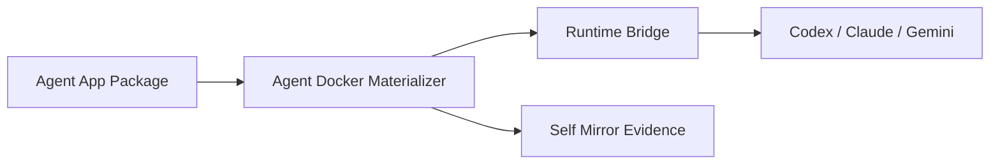

# Self Mirror Guideline

一句话：Self Mirror 是面向 Agent 开发的代码自我说明规范，让代码、错误、依赖、执行证据都能被 Agent 检索和接管。

三句话：本仓库定义 `@sm` 注释、Mermaid 邻接图、结构化 error/warning/info 契约。它不替代普通代码设计，而是给关键边界、复杂流转、失败路径加一层可机器检索的自我镜像。Adocker、Agent Docker、Legion Docker、Happy/Aha runtime bridge 后续都应按这个规范写新代码和设计稿。

五句话：Agent 写代码时最大的维护风险不是没有注释，而是注释不能回答“我在哪、我依赖谁、我失败时说明了什么”。Self Mirror 要求每个关键 node 都有稳定 id、feature、prev、next、deps、evidence。每个 error/warning/info 都必须说明 code、feature、purpose、reason、location、remediation。设计稿用 Mermaid 说明结构，代码用短标记连接到设计稿和证据，避免把整份设计塞进源文件。所有规范都可以同步到 gbrain，并能被 GitNexus 的符号/依赖图校验。

## 一键安装

发布到 GitHub 后按这个方式安装：

```bash
curl -sfL https://raw.githubusercontent.com/copizzah/self-mirror-guideline/main/install.sh | bash
```

卸载：

```bash
curl -sfL https://raw.githubusercontent.com/copizzah/self-mirror-guideline/main/install.sh | bash -s -- --uninstall
```

如果仓库地址还没有固定，可以用环境变量安装 fork：

```bash
SELF_MIRROR_REPO=https://github.com/<owner>/self-mirror-guideline.git \
  bash install.sh
```

安装结果：

- 克隆或更新到 `$CODEX_HOME/self-mirror-guideline`
- 安装 skill bundle 到 `$CODEX_HOME/skills/self-mirror-guideline`
- bundle 包含 `SKILL.md`、`references/`、`examples/`、`schemas/`、`docs/`

## 仓库结构

- `SKILL.md`: 可安装到 Codex/Claude 的 Self Mirror skill。
- `install.sh`: 参考 `claude-for-codex` 风格的一键安装器。
- `references/comment-markers.md`: `@sm` 注释标记规范。
- `references/error-warning-info-contract.md`: 结构化错误、警告、信息事件契约。
- `references/mermaid-adjacency-comments.md`: Mermaid 邻接图和代码注释如何互相连接。
- `references/gitnexus-mermaid-workflow.md`: GitNexus + Mermaid 约束工作流。
- `schemas/self-mirror-event.schema.json`: 事件结构 JSON Schema。
- `examples/typescript-self-mirror.ts`: TypeScript 示例。

## 全局原则

1. 先说明 node，再说明代码。
2. 注释只标记可检索的结构事实，不复述代码表面行为。
3. 错误不是字符串，错误是带 feature、purpose、location 的事件。
4. Mermaid 放在设计稿或邻接文档里，源代码只放稳定锚点和短关系。
5. GitNexus 负责发现真实依赖，Self Mirror 负责把依赖解释成 Agent 能执行的上下文。

## 最小落地标准

新模块至少包含：

- 一个 Mermaid node id。
- 一个 `@sm:node` 注释锚点。
- 一个 `@sm:feature` 功能归属。
- 一个 `@sm:evidence` 验证命令或证据。
- 失败路径使用结构化 `SelfMirrorEvent`。

## Adocker 适配

Adocker 的每个核心模块都应该先有设计稿，再有实现：



对应代码锚点示例：

```ts
// @sm:node adocker.materializer.resolve-package
// @sm:feature agent-docker.materialize
// @sm:prev package-registry.fetch
// @sm:next runtime-bridge.launch
// @sm:deps credential-broker,docker-volume-linker,self-mirror-event
// @sm:evidence pnpm test packages/adocker-materializer
```

## gbrain 镜像建议

每次冻结规范版本时，在 gbrain 建一页：

- slug: `projects/agent-cli/self-mirror-guideline/vN`
- links:
  - `projects/agent-cli/adocker/project-mainline-context-v1`
  - `projects/agent-cli/adocker/adocker-system-architecture-v1`
- timeline:
  - 记录规范版本、关键变更、验证方式。
