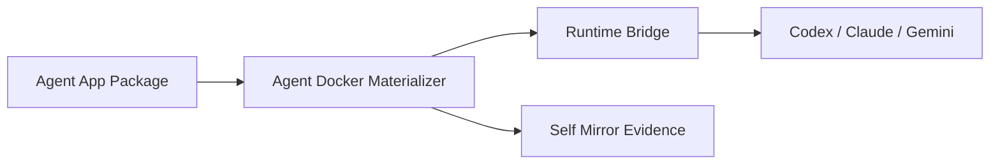

# Self Mirror Guideline

一句话：Self Mirror 是面向 Agent 开发的 all-in-one 自我说明规范，让意图、价值、Mirror Graph、代码、错误、依赖、rank 和执行证据都能被 Agent 检索和接管。

三句话：本仓库定义 `@sm` 注释、Mermaid/Mirror Graph、GitNexus/CodeFlow 证据、访谈驱动 rank、结构化 error/warning/info 契约。它不替代普通代码设计，而是给关键边界、复杂流转、失败路径、需求排序和 agent handoff 加一层可机器检索的自我镜像。Adocker、Agent Docker、Legion Docker、Happy/Aha runtime bridge 后续都应按这个规范写新代码和设计稿。

五句话：Agent 写代码时最大的维护风险不是没有注释，而是系统不能回答"我在哪、为什么重要、谁需要它、它为什么排在前面、我依赖谁、失败时说明了什么"。Self Mirror 要求每个关键 node 都有稳定 id、intent、value、rank evidence、feature、prev、next、deps、evidence。每个 error/warning/info 都必须说明 code、feature、purpose、reason、location、remediation。设计稿用 Mermaid/Mirror Graph 说明结构，代码用短标记连接到设计稿和证据，避免把整份设计塞进源文件。所有规范都可以同步到 gbrain，并能被 GitNexus 的符号/依赖图、CodeFlow 的 repo 影响面、访谈证据共同校验。

## 一键安装

### Claude Code（推荐）

```bash
curl -sfL https://raw.githubusercontent.com/Shiyao-Huang/self-mirror-guideline/main/install.sh | bash
```

### Codex

```bash
SELF_MIRROR_TARGET=codex curl -sfL https://raw.githubusercontent.com/Shiyao-Huang/self-mirror-guideline/main/install.sh | bash
```

### 同时安装到 Claude Code 和 Codex

```bash
SELF_MIRROR_TARGET=all curl -sfL https://raw.githubusercontent.com/Shiyao-Huang/self-mirror-guideline/main/install.sh | bash
```

### 卸载

```bash
curl -sfL https://raw.githubusercontent.com/Shiyao-Huang/self-mirror-guideline/main/install.sh | bash -s -- --uninstall
```

### 安装 fork

```bash
SELF_MIRROR_REPO=https://github.com/<owner>/self-mirror-guideline.git \
  curl -sfL https://raw.githubusercontent.com/Shiyao-Huang/self-mirror-guideline/main/install.sh | bash
```

### 安装结果

- 自动检测 Claude Code (`~/.claude/skills/`) 和/或 Codex (`$CODEX_HOME/skills/`)
- 克隆或更新到 `$XDG_CACHE_HOME/self-mirror-guideline/repo`
- 安装 skill bundle 到 `skills/self-mirror-guideline/`
- bundle 包含 `SKILL.md`、`dependencies.json`、`scripts/`、`vendor/`、`references/`、`examples/`、`schemas/`、`docs/`

安装后验证 all-in-one 依赖：

```bash
python3 ~/.codex/skills/self-mirror-guideline/scripts/install_dependencies.py --check-only
```

## 仓库结构

- `SKILL.md`: Claude Code / Codex 可安装的 Self Mirror skill。
- `install.sh`: 一键安装器，支持 curl pipe 和双平台检测。
- `dependencies.json`: all-in-one mirror stack 依赖清单。
- `scripts/install_dependencies.py`: 安装/验证 `mermaid-architect`、`codeflow`、`gitnexus`、`node`、`python3`。
- `vendor/mermaid-architect`: 从 `Zooeyii/mermaid-architect` 拉取的完整 Mirror Graph 子 skill，并叠加 Self Mirror / interview-rank 扩展。
- `references/comment-markers.md`: `@sm` 注释标记规范。
- `references/error-warning-info-contract.md`: 结构化错误、警告、信息事件契约。
- `references/mermaid-adjacency-comments.md`: Mermaid 邻接图和代码注释如何互相连接。
- `references/gitnexus-mermaid-workflow.md`: GitNexus + Mermaid 约束工作流。
- `schemas/self-mirror-event.schema.json`: 事件结构 JSON Schema。
- `examples/typescript-self-mirror.ts`: TypeScript 示例。

## 全局原则

1. 先说明 node，再说明代码。
2. 注释只标记可检索的结构事实，不复述代码表面行为。
3. 错误不是字符串，错误是带 feature、purpose、location 的事件。
4. Mermaid 放在设计稿或邻接文档里，源代码只放稳定锚点和短关系。
5. GitNexus 负责发现真实依赖，CodeFlow 负责发现 repo 影响面，Mirror Graph 负责执行拓扑，Self Mirror 负责把它们解释成 Agent 能执行和接手的上下文。
6. 需求和 node 的 rank 必须来自访谈证据；模拟用户只能用于形成访谈假设。

## 最小落地标准

新模块至少包含：

- 一个 Mermaid node id。
- 一个 `@sm:node` 注释锚点。
- 一个 `@sm:feature` 功能归属。
- 一个 `@sm:evidence` 验证命令或证据。
- 失败路径使用结构化 `SelfMirrorEvent`。

## All-in-one Mirror Stack

```text
Self Mirror = intent + value + rank + graph + anchors + events + evidence
Mirror Graph = object graph + Mermaid render + blockers + ready nodes
GitNexus = definitions + callers + callees + flow evidence
CodeFlow = repo map + impact + ownership/churn + cross-repo contracts
Interview Evidence = user-world pain + workaround + severity + natural rank
```

Use `self-mirror-guideline` as the main entrypoint. Use `mermaid-architect` as the graph execution subskill when object graph queries, ready nodes, blockers, or Mermaid DAG updates are needed.

## Adocker 适配

Adocker 的每个核心模块都应该先有设计稿，再有实现：



对应代码锚点示例：

```ts
// @sm:node adocker.materializer.resolve-package
// @sm:feature agent-docker.materialize
// @sm:prev package-registry.fetch
// @sm:next runtime-bridge.launch
// @sm:deps credential-broker,docker-volume-linker,self-mirror-event
// @sm:evidence pnpm test packages/adocker-materializer
```

## gbrain 镜像建议

每次冻结规范版本时，在 gbrain 建一页：

- slug: `projects/agent-cli/self-mirror-guideline/vN`
- links:
  - `projects/agent-cli/adocker/project-mainline-context-v1`
  - `projects/agent-cli/adocker/adocker-system-architecture-v1`
- timeline:
  - 记录规范版本、关键变更、验证方式。
