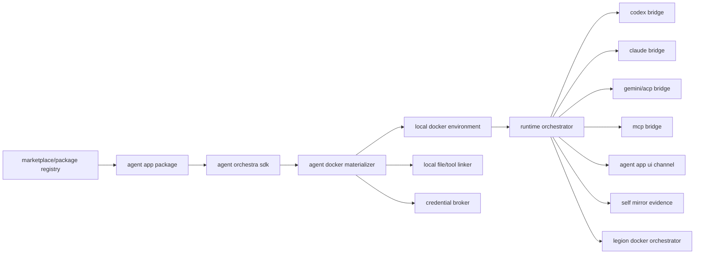

# GitNexus + Mermaid Workflow

一句话：GitNexus 发现真实代码关系，Mermaid 固化设计关系，Self Mirror 把两者绑定到代码锚点。

## Workflow

1. Use GitNexus to inspect definitions, callers, callees, flows, and clusters.
2. Convert the discovered flow into Mermaid nodes.
3. Add `@sm` anchors only on nodes that matter architecturally.
4. Emit structured Self Mirror events on failure/degraded paths.
5. Save the design draft and mirror it to gbrain.

## Commands

```bash
gitnexus status
gitnexus query -r happy -l 10 "runClaude runCodex MCP bridge AgentBackend"
gitnexus context -r happy runClaude
gitnexus context -r happy runCodex
gitnexus context -r happy CodexAppServerClient
```

## Adocker Node Set



## Happy Insights To Preserve

- `AgentBackend` is the adapter contract; Adocker needs an SDK-level equivalent.
- `runClaude` and `runCodex` both create machine/session metadata before launching runtime bridge logic.
- Happy MCP uses local HTTP plus optional STDIO bridge; Adocker should treat MCP as transport material, not as role text injection.
- UI already understands tools, permissions, and runtime flavor; Adocker should keep UI channel independent from CLI launch details.
- Offline/reconnect logic is a first-class runtime concern, not an afterthought.

## Mermaid Architecture Tooling

If `mermaid-architecture` exists, use it to render and validate graphs. If absent, keep standard Mermaid blocks in Markdown and record the absence as a warning event:

```json
{
  "level": "warning",
  "code": "SMR-ARC-001",
  "feature": "self-mirror.architecture",
  "purpose": "Validate architecture graph rendering",
  "reason": "mermaid-architecture command is not installed",
  "location": {
    "file": "references/gitnexus-mermaid-workflow.md"
  },
  "remediation": "Install mermaid-architecture or validate Markdown Mermaid rendering in CI."
}
```

