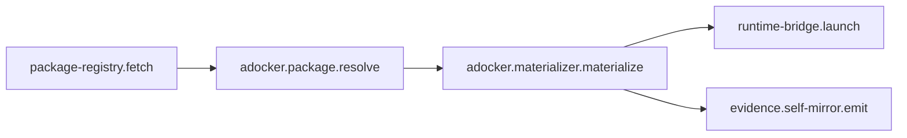
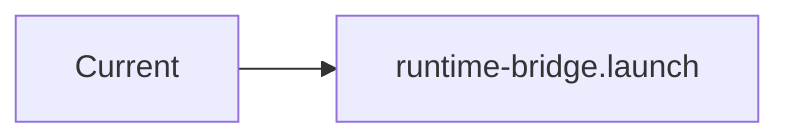

# Mermaid Adjacency Comments

Mermaid carries the architecture. Code comments carry stable anchors back to that architecture.

## Design Doc Block

Each design doc should contain a node graph near the top:



## Source Anchor

In source, reference the graph by node id:

```ts
// @sm:node adocker.materializer.materialize
// @sm:feature agent-docker.materialize
// @sm:prev adocker.package.resolve
// @sm:next runtime-bridge.launch
// @sm:deps docker-volume-linker,credential-broker,evidence.self-mirror.emit
// @sm:evidence pnpm test packages/adocker-materializer
```

## Mermaid Scope

Use Mermaid for:

- runtime flow;
- data flow;
- trust boundaries;
- package materialization;
- context injection;
- error propagation.

Avoid putting large Mermaid graphs directly in source files. Put them in:

- `docs/architecture/*.md`
- `Adocker/design/drafts/*.md`
- gbrain mirror pages

Then link source to the graph with `@sm:node` and `@sm:gbrain`.

## Consistency Rule

If a code marker says:

```ts
// @sm:next runtime-bridge.launch
```

then a Mermaid graph must contain:



